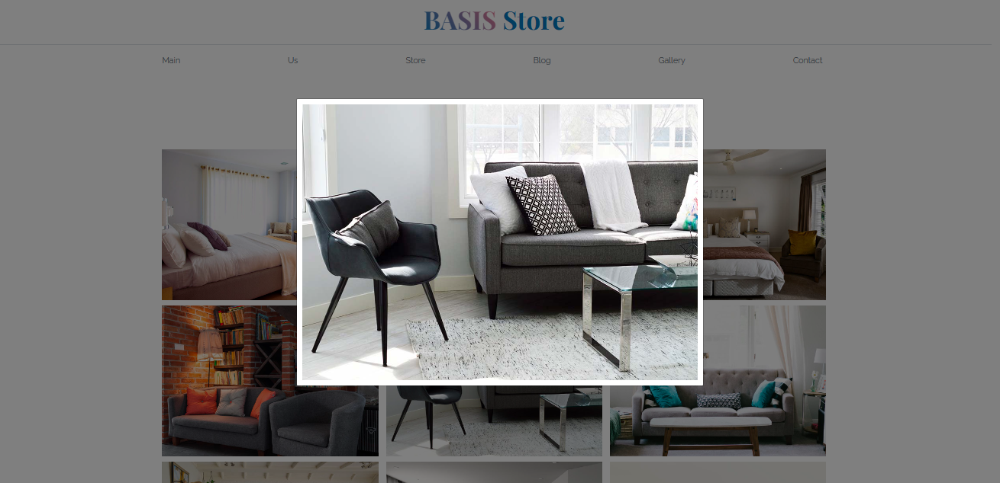

## Bootstrap 5 used clases in this proyect

><header></header>
><nav></nav>
***the idea of navabar is to display links from horizontal view in md and up brakpoints and center links with a toggler menu in small devices.***

>.container = in lg display will fit in devices > or = 992px to 960px

>navbar-nav: "from Supported Content" for a full-height and lightweight navigation (including support for dropdowns).
WHAT I UNDERSTEND IS: THAT THIS  CLASS IS COVERIGNG FULL HEIGHT IF YOU PASS THE NORMAL ONE LINE NAVBAR.
AT THE SAME TIME :ADDING THIS CLASS TO THE NAV TAG:
~~~
   <nav>
      <a href="">Link 1</a>
      <a href="">Link 2</a>
      <a href="">Link 3</a>
      <a href="">Link 4</a>
      <a href="">Link 5</a>
    </nav>
    RESULT = Link 1 Link 2 Link 3 Link 4 Link 5
    HORIZONTAL ROW DISPLAY in all breakpoints
~~~

    <nav class="navbar-nav">
      <a href="">Link 1</a>
      <a href="">Link 2</a>
      <a href="">Link 3</a>
      <a href="">Link 4</a>
      <a href="">Link 5</a>
    </nav>
    RESULT = DISPLAY in all breakpoints
    Link 1
    Link 2
    Link 3
    Link 4
    Link 5
> d-flex flex-md-row justify-content-md-between text-center OK

## ***THE TOGGLE MENU OR HAMBURGUER MENU***
~~~
   

      

        <a class="nombre-sitio navbar-brand d-lg-none fs-2 fw-bold text-uppercase" href="index.html">
          Forniture Store
        </a>
        <button class="navbar-toggler border-0" type="button" data-bs-toggle="collapse" data-bs-target="#navegacion">
          
        </button>
        

          <nav class="navbar-nav container d-flex flex-md-row justify-content-md-between text-center py-3">  
             ...
          </nav>
        

      

    

~~~
~~~

 it's the principal container
~~~
~~~

 Display or hide the toggler menu
~~~
>navbar= add some ruleset styles to the navigation, like send hamb icon to the right in the sm brakpoint.
>navbar-expand-lg= set the size in wich navbar bar will display itself in an expanded form ** then lg display will fit in devices > or = 992px to 960px... at that breakpoint navbar will display horizontal, less than 992 will display verticla for small devices. Also if the navbar doesnt contain it, will not display the navigation links
>container = the size
>navbar-light= is the class that gives hamburger menu it's color

~~~
  <button 
  class="navbar-toggler border-0" type="button" data-bs-toggle="collapse" data-bs-target="#navegacion">
    
  </button>
~~~
><ins>.navbar-toggler</ins> = for use with our collapse plugin and other navigation toggling behaviors. (thte colapse an appearence of hamb menu).
The button has a span with "navbar-toggler-icon", this icon changes when we click on it, showing an X or three bars.
><ins>border-0 </ins> = deletes a border towards hamb menu
><ins>data-bs-toggle and data-bs-target</ins> are used to make an action when you click on this button.
> <ins>span class="navbar-toggler-icon" </ins>= displays the icon itself but remember that has to had the color specifien in the div with navbar...
<ins></ins>

~~~

~~~
>The div "id=navegacion" makes the hamburguer menu works, it's linked with the class collapse from bootstrap.
><ins>.collapse.navbar-collapse</ins> = for grouping and hiding navbar contents by a parent breakpoint.

> ***THE CONCEPT OF***:
> order-0, -1, -2 is the right and left place you can change order from original setup
> ALso they only works with d-flex